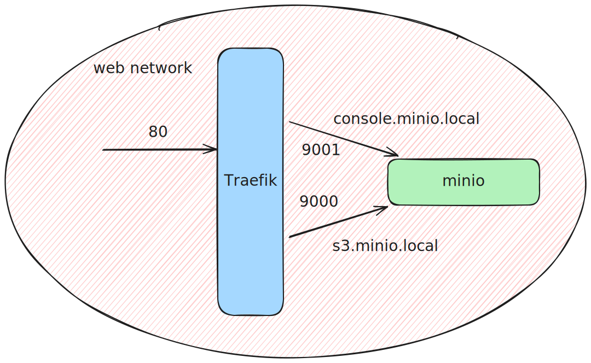

# Stack de Armazenamento S3-Compatível com MinIO e Traefik

   

Este repositório contém a infraestrutura como código (IaC) para um serviço de armazenamento de objetos local, S3-compatível, utilizando MinIO, com um proxy reverso dinâmico Traefik para gerenciamento de rotas e acesso via domínios locais.

## ✨ Features

* **Armazenamento S3-Compatível:** Serviço de armazenamento de objetos robusto com MinIO.
* **Proxy Reverso Dinâmico:** Uso do Traefik para descoberta automática de serviços e roteamento baseado em nomes de domínio.
* **Domínios Locais:** Acesso aos serviços através de URLs amigáveis como `http://console.minio.local`.
* **Infraestrutura como Código:** Todo o stack é definido de forma declarativa usando `docker-compose`.
* **Pronto para Produção:** Utiliza melhores práticas como versionamento de imagens, `healthchecks` e configuração via variáveis de ambiente.

## 🏗️ Diagrama da Arquitetura

 

## 🚀 Como Executar

Siga os passos abaixo para iniciar o stack de armazenamento localmente.

### 1. Pré-requisitos

* [Docker](https://docs.docker.com/get-docker/) instalado e rodando.
* [Docker Compose](https://docs.docker.com/compose/install/) instalado.

### 2. Clone o Repositório
```bash
git clone https://github.com/RafaelQSantos-RQS/minio
cd miniom
```

### 3. Crie a Rede Externa
Como este stack foi projetado para se integrar com outros, ele espera que a rede `web` já exista. Crie-a com o seguinte comando:
```bash
docker network create web
```

### 4. Configure os Domínios Locais
Edite seu arquivo `hosts` para mapear os domínios locais para sua máquina.
* **No Linux/macOS:** `/etc/hosts`
* **No Windows:** `C:\Windows\System32\drivers\etc\hosts`

Adicione a seguinte linha ao final do arquivo:
```
127.0.0.1   console.minio.local s3.minio.local
```

### 5. Configure as Variáveis de Ambiente
Copie o arquivo de exemplo `.env.example` para um novo arquivo chamado `.env`.
```bash
cp .env.example .env
```
Você pode customizar os valores no arquivo `.env` se desejar.

### 6. Inicie os Serviços
Com tudo configurado, inicie os containers em modo detached (background):
```bash
docker-compose up -d
```

### 7. Acesse os Serviços
* **Console do MinIO:** [http://console.minio.local](http://console.minio.local)
* **Dashboard do Traefik:** [http://localhost:8080](http://localhost:8080)

As credenciais padrão para o MinIO estão definidas no seu arquivo `.env`.

## 📂 Estrutura do Projeto
```
.
├── data/                 # (Criado pelo Docker) Armazena os dados do MinIO
├── docker-compose.yml    # Define os serviços Traefik e MinIO
├── traefik.yml           # Configuração estática do Traefik
├── .env                  # (Ignorado) Suas variáveis de ambiente locais
├── .env.example          # Exemplo de variáveis de ambiente
└── README.md             # Esta documentação
```
